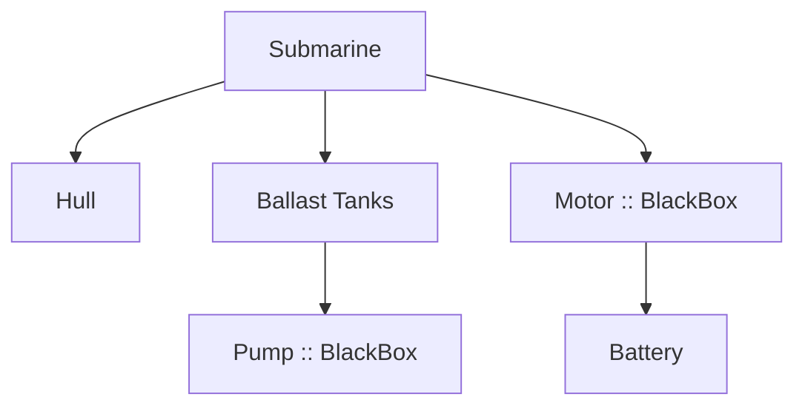

# How to Build a Submarine

Building a submarine is ambitious when you are just one person. Grit Labs templates help break the work into clear pieces so nothing gets lost.

## Step 1. Write Down the Mission

A short Goals snapshot keeps the big picture organized.

```yaml
mission:
  id: diy-submarine
  statement: Build a small, one-person submarine for shallow exploration.
  goals:
    - id: hull-integrity
      statement: Hull withstands pressure at 50 m depth.
      status: proposed
      acceptanceTests:
        - tests/pressure-hull.yaml
    - id: buoyancy-control
      statement: Dive and surface safely using ballast tanks.
      status: proposed
      acceptanceTests:
        - tests/buoyancy-control.py
```

## Step 2. Capture the First Action Schema

```markdown
MySubmarinePlan — v0.1

| Tag  | # | Task                            | Status      | Next action / note            | Test-cases / validation checks |
|------|---|---------------------------------|-------------|------------------------------|--------------------------------|
| feat | 1 | Draft hull design               | Not started | Research pressure formulas   | docs/hull-sketch.png           |
| feat | 2 | Outline ballast control system  | Not started | Sketch valves and pumps      | tests/buoyancy-control.py      |
| fix  | 3 | Acquire pressure gauge          | Not started | Find used equipment source   | tests/pressure-gauge.yaml      |
| docs | 4 | Record unanswered questions     | Not started | List unknowns                | docs/pages/unknowns.md               |
```

## Step 3. Map Dependencies

A simple dependency graph clarifies which components rely on others. Components marked with `BlackBox` are outside my expertise.



The pump and motor are black box components—I can identify that they exist, but I do not know how to build them.

## Step 4. Document Sticking Points

Grit Labs encourages noting blockers explicitly. I create a short list in `docs/pages/unknowns.md`:

```markdown
# Unknowns

- Can I fabricate a safe pressure hull on my own?
- Where do I source a reliable pump for the ballast system?
- What safety certifications are required before a test dive?
```

## Step 5. Iterate

Each rotation updates the Action Schema. If I solve the pump problem, I mark that item **Done ✅** and write the next Action Item. Until then, the black box components remain placeholders while I research or seek expert help.

---

**Summary**: Using the Goals file, Action Schema, and Dependency Modeling, I can track progress even when certain pieces (like the motor and pump) are beyond my ability. The templates keep the effort organized and highlight exactly where I'm blocked.
